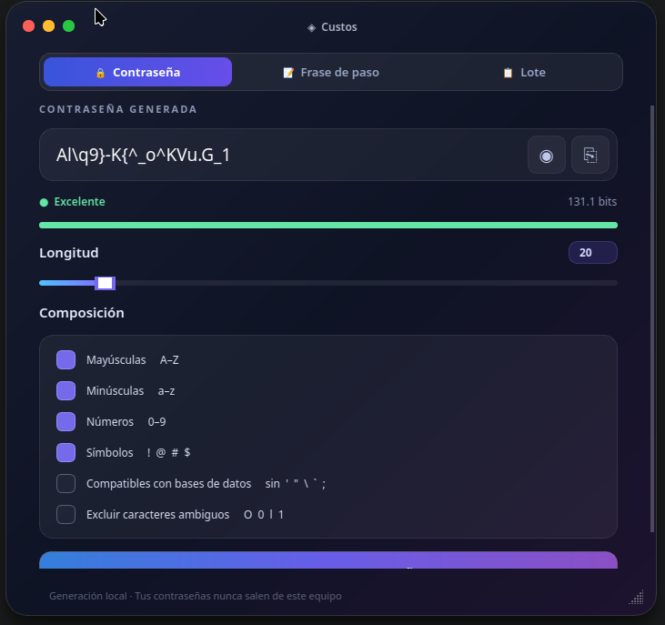
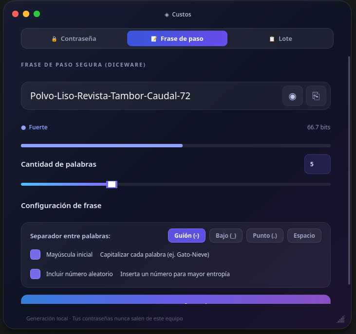
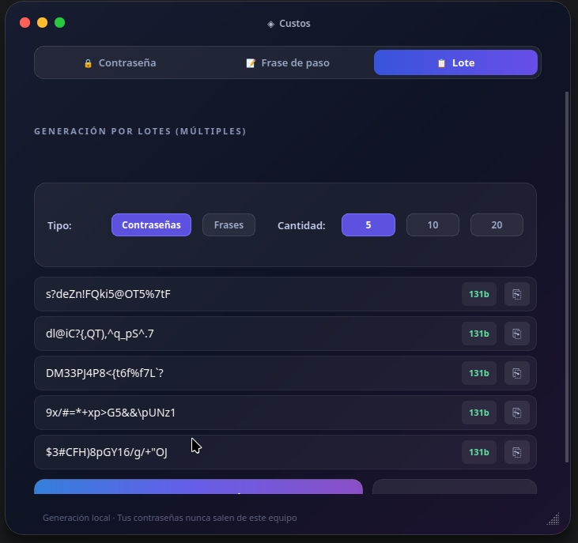

# Custos

Generador de contraseñas, frases de paso (Diceware) y lotes seguros para
Linux y Windows. 100% local: no hace peticiones de red ni depende de
servicios externos. GUI (PySide6) y modo de línea de comandos en el mismo
programa.

🌐 [Read in English](README.en.md)

## Capturas de pantalla

<p align="center">
  
  
  
</p>

## Funciones

- **Contraseñas**: longitud configurable (8–128, por defecto 20), con control
  independiente de mayúsculas, minúsculas, dígitos y símbolos. Garantiza al
  menos un carácter de cada categoría elegida.
- **Frases de paso (Diceware)**: lista curada de 1024 palabras en español
  (`wordlist.py`), de 3 a 10 palabras (por defecto 5), separador
  configurable, capitalización y número insertado opcionales.
- **Modo seguro**: excluye símbolos problemáticos para bases de datos
  (comillas, barras, punto y coma) y, aparte, un modo para excluir
  caracteres ambiguos (`0`, `O`, `1`, `l`, `I`, etc.).
- **Entropía**: cálculo de bits de entropía y clasificación de fortaleza
  para cada resultado generado.
- **Lotes**: genera varias contraseñas o frases de paso de una sola vez.
- **Portapapeles**: copia directa al portapapeles (Wayland vía `wl-copy`,
  X11 vía `xclip`; en Windows usa el portapapeles nativo de Qt).
- **CLI y GUI**: el mismo binario decide automáticamente, o se fuerza con
  `--gui` / `--cli`.

Generación con el módulo `secrets` de Python (aleatoriedad criptográfica),
sin llamadas de red en ningún punto del código.

## Uso por línea de comandos

```bash
custos --cli -l 24 -e                    # contraseña de 24 caracteres + entropía
custos --cli -p -w 6 -C                  # frase de paso de 6 palabras, copiada al portapapeles
custos --cli -c 5 --safe                 # lote de 5 contraseñas, símbolos seguros para BD
custos --cli --help                      # ver todas las opciones
```

## Instalación

Requisitos: Linux de escritorio, Python 3, `python3-venv`. Bibliotecas Qt
para PySide6 (ver [requisitos de Qt para Linux](https://doc.qt.io/qt-6/linux-requirements.html)).

```bash
git clone https://github.com/SRGP74mex/Custos.git
cd Custos
./install.sh
```

El instalador crea un entorno virtual propio en
`~/.local/share/custos/.venv`, instala `PySide6`, y agrega el acceso al
menú de aplicaciones. No lo ejecutes con `sudo`.

Para desinstalar:

```bash
./uninstall.sh
```

### Windows

Ver [docs/CAMBIOS-WINDOWS.md](docs/CAMBIOS-WINDOWS.md) para el detalle
técnico de los cambios que hicieron posible este soporte.

La forma más simple para un usuario final es el instalador MSI (ver
[Descargas](#descargas-windows) o compílalo tú mismo más abajo). También
existe una instalación basada en Python, equivalente a `install.sh`:

Requisitos: Python 3.9+ (`winget install Python.Python.3.12` si no lo tienes).

```powershell
git clone https://github.com/SRGP74mex/Custos.git
cd Custos
.\install.ps1
```

Crea un entorno virtual en `%LOCALAPPDATA%\Custos\.venv`, instala `PySide6`,
agrega un acceso directo al menú Inicio y expone el comando `custos` en una
nueva terminal. Para desinstalar: `.\uninstall.ps1`.

#### Descargas (Windows)

En [Releases](https://github.com/SRGP74mex/Custos/releases) se publica
`Custos-Setup.msi`: instala en `Program Files`, agrega el acceso directo del
menú Inicio y aparece en «Agregar o quitar programas» (requiere permisos de
administrador). No necesita tener Python instalado.

#### Compilar el .exe / .msi tú mismo

Requiere Python 3.9+ y, para el MSI, [WiX Toolset
v3](https://wixtoolset.org/) (`winget install WiXToolset.WiXToolset`):

```powershell
.\build_windows.ps1   # genera dist\Custos.exe (standalone, con PyInstaller)
.\build_msi.ps1        # empaqueta dist\Custos.exe en dist\Custos-Setup.msi
```

`build_windows.ps1` crea un entorno de build en `.venv-build`, instala
`PySide6` y `pyinstaller`, y empaqueta `generador_contrasenas.py` en un único
`.exe` en modo `--windowed` (sin consola, por lo que solo sirve para la GUI;
para `--cli` usa `install.ps1`). Si existe `custos.ico` en la raíz del
proyecto (generado a partir de `custos.svg`), se usa como icono del `.exe`.

`build_msi.ps1` toma ese `.exe` y genera un instalador MSI (`dist\Custos-Setup.msi`)
con [`wix/Product.wxs`](wix/Product.wxs): instalación en `Program Files`,
acceso directo del menú Inicio, entrada en «Agregar o quitar programas»,
licencia GPL-3.0 en el asistente y soporte de actualización (`MajorUpgrade`)
para versiones futuras. Acepta `-Version` para fijar la versión del paquete,
por ejemplo `.\build_msi.ps1 -Version 1.1.0.0`.

## Licencia

Código bajo [GPL-3.0](LICENSE).
